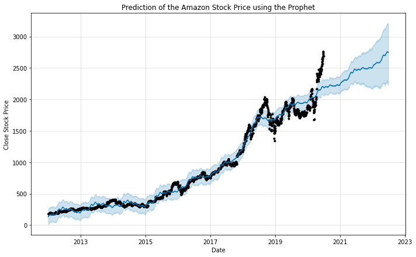
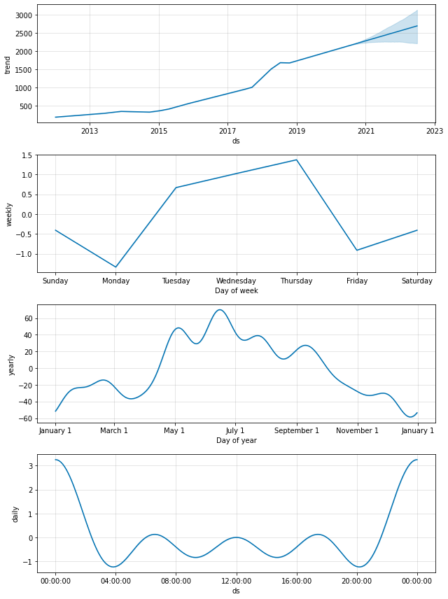
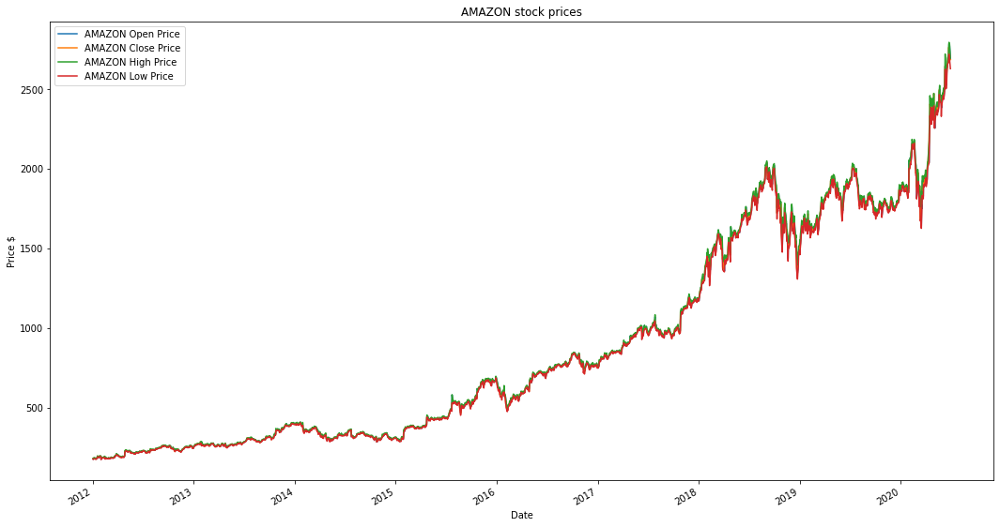
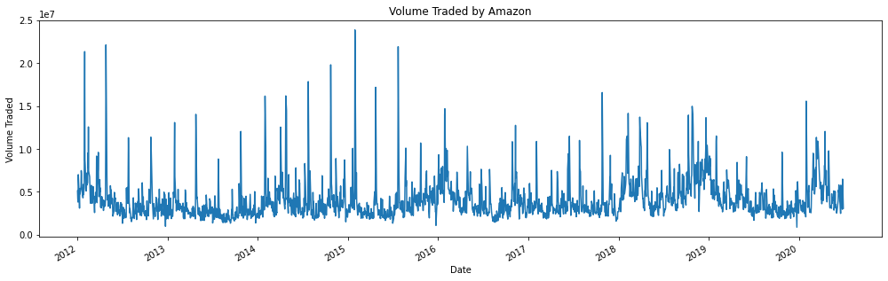
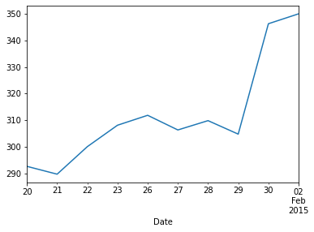
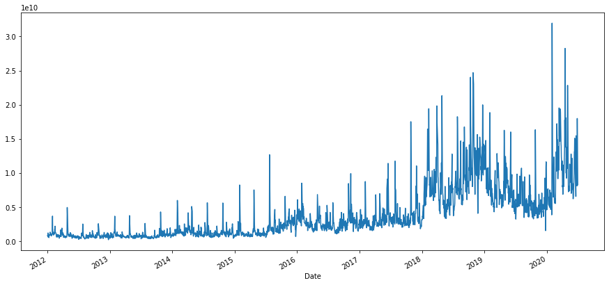

```python
import pandas_datareader.data as web
import pandas as pd
import datetime 
from datetime import date
import matplotlib.pyplot as plt
import numpy as np
import plotly.express as px
%matplotlib inline
```


```python
today = date.today()
today
```


    datetime.date(2020, 6, 29)


```python

start = datetime.datetime(2012,1,1)
end = today
```


```python
amazon = web.DataReader("AMZN", 'yahoo', start, end)
```


```python
#if you want to import as csv
amazon.to_csv('Amazon.csv')
```


```python
#reading csv
am = pd.read_csv('Amazon.csv')
```


```python
#checking if we have the same dataset as amazon.head()
am.head() 
```


<div>
<style scoped>
    .dataframe tbody tr th:only-of-type {
        vertical-align: middle;
    }

    .dataframe tbody tr th {
        vertical-align: top;
    }

    .dataframe thead th {
        text-align: right;
    }
</style>
<table border="1" class="dataframe">
  <thead>
    <tr style="text-align: right;">
      <th></th>
      <th>Date</th>
      <th>High</th>
      <th>Low</th>
      <th>Open</th>
      <th>Close</th>
      <th>Volume</th>
      <th>Adj Close</th>
    </tr>
  </thead>
  <tbody>
    <tr>
      <th>0</th>
      <td>2012-01-03</td>
      <td>179.479996</td>
      <td>175.550003</td>
      <td>175.889999</td>
      <td>179.029999</td>
      <td>5110800</td>
      <td>179.029999</td>
    </tr>
    <tr>
      <th>1</th>
      <td>2012-01-04</td>
      <td>180.500000</td>
      <td>176.070007</td>
      <td>179.210007</td>
      <td>177.509995</td>
      <td>4205200</td>
      <td>177.509995</td>
    </tr>
    <tr>
      <th>2</th>
      <td>2012-01-05</td>
      <td>178.250000</td>
      <td>174.050003</td>
      <td>175.940002</td>
      <td>177.610001</td>
      <td>3809100</td>
      <td>177.610001</td>
    </tr>
    <tr>
      <th>3</th>
      <td>2012-01-06</td>
      <td>184.649994</td>
      <td>177.500000</td>
      <td>178.070007</td>
      <td>182.610001</td>
      <td>7008400</td>
      <td>182.610001</td>
    </tr>
    <tr>
      <th>4</th>
      <td>2012-01-09</td>
      <td>184.369995</td>
      <td>177.000000</td>
      <td>182.759995</td>
      <td>178.559998</td>
      <td>5056900</td>
      <td>178.559998</td>
    </tr>
  </tbody>
</table>
</div>


```python
#checking if we have the same dataset as am.head()
amazon.head() 
```


<div>
<style scoped>
    .dataframe tbody tr th:only-of-type {
        vertical-align: middle;
    }

    .dataframe tbody tr th {
        vertical-align: top;
    }

    .dataframe thead th {
        text-align: right;
    }
</style>
<table border="1" class="dataframe">
  <thead>
    <tr style="text-align: right;">
      <th></th>
      <th>High</th>
      <th>Low</th>
      <th>Open</th>
      <th>Close</th>
      <th>Volume</th>
      <th>Adj Close</th>
    </tr>
    <tr>
      <th>Date</th>
      <th></th>
      <th></th>
      <th></th>
      <th></th>
      <th></th>
      <th></th>
    </tr>
  </thead>
  <tbody>
    <tr>
      <th>2012-01-03</th>
      <td>179.479996</td>
      <td>175.550003</td>
      <td>175.889999</td>
      <td>179.029999</td>
      <td>5110800</td>
      <td>179.029999</td>
    </tr>
    <tr>
      <th>2012-01-04</th>
      <td>180.500000</td>
      <td>176.070007</td>
      <td>179.210007</td>
      <td>177.509995</td>
      <td>4205200</td>
      <td>177.509995</td>
    </tr>
    <tr>
      <th>2012-01-05</th>
      <td>178.250000</td>
      <td>174.050003</td>
      <td>175.940002</td>
      <td>177.610001</td>
      <td>3809100</td>
      <td>177.610001</td>
    </tr>
    <tr>
      <th>2012-01-06</th>
      <td>184.649994</td>
      <td>177.500000</td>
      <td>178.070007</td>
      <td>182.610001</td>
      <td>7008400</td>
      <td>182.610001</td>
    </tr>
    <tr>
      <th>2012-01-09</th>
      <td>184.369995</td>
      <td>177.000000</td>
      <td>182.759995</td>
      <td>178.559998</td>
      <td>5056900</td>
      <td>178.559998</td>
    </tr>
  </tbody>
</table>
</div>


```python
am.describe()
```


<div>
<style scoped>
    .dataframe tbody tr th:only-of-type {
        vertical-align: middle;
    }

    .dataframe tbody tr th {
        vertical-align: top;
    }

    .dataframe thead th {
        text-align: right;
    }
</style>
<table border="1" class="dataframe">
  <thead>
    <tr style="text-align: right;">
      <th></th>
      <th>High</th>
      <th>Low</th>
      <th>Open</th>
      <th>Close</th>
      <th>Volume</th>
      <th>Adj Close</th>
    </tr>
  </thead>
  <tbody>
    <tr>
      <th>count</th>
      <td>2136.000000</td>
      <td>2136.000000</td>
      <td>2136.000000</td>
      <td>2136.000000</td>
      <td>2.136000e+03</td>
      <td>2136.000000</td>
    </tr>
    <tr>
      <th>mean</th>
      <td>891.813977</td>
      <td>873.246040</td>
      <td>883.019420</td>
      <td>883.034588</td>
      <td>4.086646e+06</td>
      <td>883.034588</td>
    </tr>
    <tr>
      <th>std</th>
      <td>660.815862</td>
      <td>646.447716</td>
      <td>653.978635</td>
      <td>654.016994</td>
      <td>2.293480e+06</td>
      <td>654.016994</td>
    </tr>
    <tr>
      <th>min</th>
      <td>178.250000</td>
      <td>172.000000</td>
      <td>173.809998</td>
      <td>175.929993</td>
      <td>8.813000e+05</td>
      <td>175.929993</td>
    </tr>
    <tr>
      <th>25%</th>
      <td>316.897491</td>
      <td>310.727501</td>
      <td>314.007507</td>
      <td>313.132492</td>
      <td>2.669650e+06</td>
      <td>313.132492</td>
    </tr>
    <tr>
      <th>50%</th>
      <td>674.390015</td>
      <td>659.290009</td>
      <td>665.575012</td>
      <td>664.649994</td>
      <td>3.476050e+06</td>
      <td>664.649994</td>
    </tr>
    <tr>
      <th>75%</th>
      <td>1584.832550</td>
      <td>1545.562531</td>
      <td>1565.602478</td>
      <td>1571.780029</td>
      <td>4.736300e+06</td>
      <td>1571.780029</td>
    </tr>
    <tr>
      <th>max</th>
      <td>2796.000000</td>
      <td>2721.000000</td>
      <td>2780.000000</td>
      <td>2764.409912</td>
      <td>2.385610e+07</td>
      <td>2764.409912</td>
    </tr>
  </tbody>
</table>
</div>


```python
amazon.describe()
```


<div>
<style scoped>
    .dataframe tbody tr th:only-of-type {
        vertical-align: middle;
    }

    .dataframe tbody tr th {
        vertical-align: top;
    }

    .dataframe thead th {
        text-align: right;
    }
</style>
<table border="1" class="dataframe">
  <thead>
    <tr style="text-align: right;">
      <th></th>
      <th>High</th>
      <th>Low</th>
      <th>Open</th>
      <th>Close</th>
      <th>Volume</th>
      <th>Adj Close</th>
    </tr>
  </thead>
  <tbody>
    <tr>
      <th>count</th>
      <td>2136.000000</td>
      <td>2136.000000</td>
      <td>2136.000000</td>
      <td>2136.000000</td>
      <td>2.136000e+03</td>
      <td>2136.000000</td>
    </tr>
    <tr>
      <th>mean</th>
      <td>891.813977</td>
      <td>873.246040</td>
      <td>883.019420</td>
      <td>883.034588</td>
      <td>4.086646e+06</td>
      <td>883.034588</td>
    </tr>
    <tr>
      <th>std</th>
      <td>660.815862</td>
      <td>646.447716</td>
      <td>653.978635</td>
      <td>654.016994</td>
      <td>2.293480e+06</td>
      <td>654.016994</td>
    </tr>
    <tr>
      <th>min</th>
      <td>178.250000</td>
      <td>172.000000</td>
      <td>173.809998</td>
      <td>175.929993</td>
      <td>8.813000e+05</td>
      <td>175.929993</td>
    </tr>
    <tr>
      <th>25%</th>
      <td>316.897491</td>
      <td>310.727501</td>
      <td>314.007507</td>
      <td>313.132492</td>
      <td>2.669650e+06</td>
      <td>313.132492</td>
    </tr>
    <tr>
      <th>50%</th>
      <td>674.390015</td>
      <td>659.290009</td>
      <td>665.575012</td>
      <td>664.649994</td>
      <td>3.476050e+06</td>
      <td>664.649994</td>
    </tr>
    <tr>
      <th>75%</th>
      <td>1584.832550</td>
      <td>1545.562531</td>
      <td>1565.602478</td>
      <td>1571.780029</td>
      <td>4.736300e+06</td>
      <td>1571.780029</td>
    </tr>
    <tr>
      <th>max</th>
      <td>2796.000000</td>
      <td>2721.000000</td>
      <td>2780.000000</td>
      <td>2764.409912</td>
      <td>2.385610e+07</td>
      <td>2764.409912</td>
    </tr>
  </tbody>
</table>
</div>


```python
# Select only the important features i.e. the date and price
am = am[["Date","Close"]]
am.head()
```


<div>
<style scoped>
    .dataframe tbody tr th:only-of-type {
        vertical-align: middle;
    }

    .dataframe tbody tr th {
        vertical-align: top;
    }

    .dataframe thead th {
        text-align: right;
    }
</style>
<table border="1" class="dataframe">
  <thead>
    <tr style="text-align: right;">
      <th></th>
      <th>Date</th>
      <th>Close</th>
    </tr>
  </thead>
  <tbody>
    <tr>
      <th>0</th>
      <td>2012-01-03</td>
      <td>179.029999</td>
    </tr>
    <tr>
      <th>1</th>
      <td>2012-01-04</td>
      <td>177.509995</td>
    </tr>
    <tr>
      <th>2</th>
      <td>2012-01-05</td>
      <td>177.610001</td>
    </tr>
    <tr>
      <th>3</th>
      <td>2012-01-06</td>
      <td>182.610001</td>
    </tr>
    <tr>
      <th>4</th>
      <td>2012-01-09</td>
      <td>178.559998</td>
    </tr>
  </tbody>
</table>
</div>


```python
# Select only the important features i.e. the date and price
#amazon = amazon[["Date","Close"]]
#amazon.head()
```


    pandas.core.frame.DataFrame


```python
type(amazon)
```


    pandas.core.frame.DataFrame


```python
type(am)
```


    pandas.core.frame.DataFrame


```python
# Rename the features: These names are NEEDED for the model fitting
am = am.rename(columns = {"Date":"ds","Close":"y"}) #renaming the columns of the dataset
```


```python
from fbprophet import Prophet
m = Prophet(daily_seasonality = True) # the Prophet class (model)
m.fit(am) # fit the model using all data
```

    INFO:numexpr.utils:NumExpr defaulting to 8 threads.


    <fbprophet.forecaster.Prophet at 0x7f9d61ada5d0>


```python
future = m.make_future_dataframe(periods=730) #we need to specify the number of days in future
prediction = m.predict(future)
m.plot(prediction)
plt.title("Prediction of the Amazon Stock Price using the Prophet")
plt.xlabel("Date")
plt.ylabel("Close Stock Price")
plt.show()
```





```python
m.plot_components(prediction)
plt.show()
```





```python
amazon['Open'].plot(label="AMAZON Open Price", figsize=(18,10))
amazon['Close'].plot(label="AMAZON Close Price")
amazon['High'].plot(label="AMAZON High Price")
amazon['Low'].plot(label="AMAZON Low Price")
plt.title("AMAZON stock prices")
plt.ylabel("Price $")
plt.legend()
plt.show()
```





```python
amazon['Volume'].plot(figsize=(17,5))
plt.title('Volume Traded by Amazon')
plt.ylabel('Volume Traded')
plt.show()
```





```python
amazon.iloc[amazon['Volume'].argmax()]
```


    High         3.595000e+02
    Low          3.407400e+02
    Open         3.463200e+02
    Close        3.545300e+02
    Volume       2.385610e+07
    Adj Close    3.545300e+02
    Name: 2015-01-30 00:00:00, dtype: float64


```python
amazon.iloc[765:775]['Open'].plot()
```


    <matplotlib.axes._subplots.AxesSubplot at 0x7f9d490a9990>





```python
amazon['Total Traded'] = amazon['Open']*amazon['Volume']
```


```python
amazon['Total Traded'].plot(figsize=(15,7))
plt.show()
```




